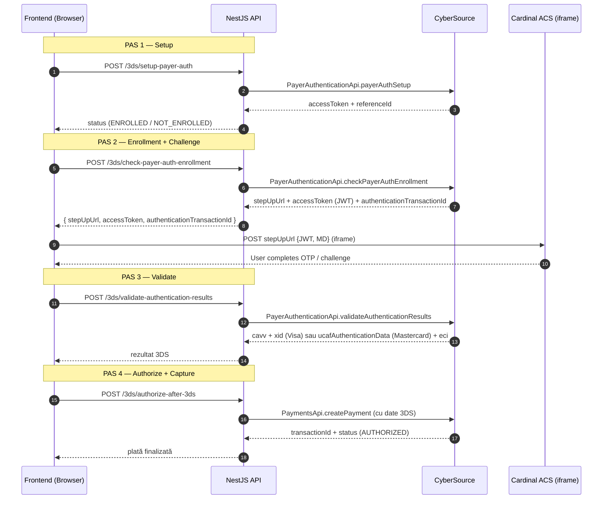

# payment-cybersource

Backend **NestJS** pentru integrare cu **CyberSource REST API** — suport pentru plăți standard, flow 3-D Secure (Visa / Mastercard) și link-uri de plată (Pay by Link).

---

## Stack

- **NestJS 11** + TypeScript
- **cybersource-rest-client** (SDK oficial Node.js)
- **Swagger / OpenAPI** — documentație interactivă la `/swagger`
- **dotenv** + `@nestjs/config` pentru configurare
- **class-validator** / **class-transformer** pentru validare DTO
- **Vercel** pentru deploy

---

## Setup rapid

```bash
npm install
cp .env.example .env
# Completează .env cu credențialele tale CyberSource
npm run start:dev
```

Swagger UI: http://localhost:3000/swagger

---

## Configurare

Toate credențialele CyberSource sunt încărcate din `.env`. Vezi [.env.example](.env.example) pentru lista completă de variabile.

| Variabilă | Descriere |
|---|---|
| `CYBERSOURCE_RUN_ENVIRONMENT` | `apitest.cybersource.com` (sandbox) sau `api.cybersource.com` (prod) |
| `CYBERSOURCE_MERCHANT_ID` | Merchant ID |
| `CYBERSOURCE_MERCHANT_KEY_ID` | UUID-ul cheii HTTP Signature |
| `CYBERSOURCE_MERCHANT_SECRET_KEY` | Cheia secretă (base64) |
| `CYBERSOURCE_PARTNER_DEVELOPER_ID` / `SOLUTION_ID` | Identificatori partener (opțional) |

Credențialele se pot genera din: **CyberSource Business Center → Key Management → HTTP Signature**.

---

## Arhitectură

```
┌─────────────────────────────────────────────────────────────┐
│                     NestJS App (main.ts)                    │
│  • Global ValidationPipe                                    │
│  • CORS enabled                                             │
│  • Swagger @ /swagger                                       │
└───────────────────────────┬─────────────────────────────────┘
                            │
        ┌───────────────────┼───────────────────┐
        │                   │                   │
┌───────▼────────┐  ┌───────▼────────┐  ┌───────▼────────┐
│ Transaction    │  │   3DS          │  │  Pay by Link   │
│ /cybersource   │  │   /3ds         │  │ /payment-links │
└───────┬────────┘  └───────┬────────┘  └───────┬────────┘
        │                   │                   │
        └───────────────────┼───────────────────┘
                            │
               ┌────────────▼────────────┐
               │ CybersourceClientService│  ← shared, @Global
               │ (configObject + apiClient)│
               └────────────┬────────────┘
                            │
                  ┌─────────▼──────────┐
                  │  CyberSource REST  │
                  │       API          │
                  └────────────────────┘
```

Modulul `CybersourceClientModule` este `@Global()` — oferă instanța `configObject` + `apiClient` + getter-e pentru fiecare API (`paymentsApi`, `payerAuthApi`, `captureApi`, `voidApi`, `transactionDetailsApi`, `paymentLinksApi`).

---

## 1. Plăți clasice — `/cybersource`

Implementare: [src/CybersourceTransaction](src/CybersourceTransaction/)

| Endpoint | CyberSource SDK | Scop |
|---|---|---|
| `POST /cybersource/authorize-simple` | `PaymentsApi.createPayment` (`capture=false`) | Auth-only: rezervă fondurile |
| `POST /cybersource/authorize-zero` | `PaymentsApi.createPayment` (totalAmount `0.00`) | Validare card fără debit (Zero Dollar Auth) |
| `POST /cybersource/authorize-capture-sale` | `PaymentsApi.createPayment` (`capture=true`) | Sale: auth + capture |
| `POST /cybersource/void-payment/:transactionId/:clientRefCode` | `VoidApi.voidPayment` | Anulează o autorizare |
| `GET /cybersource/transaction-details/:transactionId` | `TransactionDetailsApi.getTransaction` | Detalii tranzacție |

**Status de succes**: `AUTHORIZED` (auth-only / zero auth), `APPROVED`/`AUTHORIZED` (sale), `REVERSED` (void).

**Carduri de test** (sandbox):
- Visa normal: `4111111111111111`
- Visa 3DS: `4000000000002503`
- Mastercard 3DS: `5120342233150747`
- Zero-dollar auth: `5555555555554444`

---

## 2. 3-D Secure — `/3ds`

Implementare: [src/Cybersource3DS](src/Cybersource3DS/)

Flow-ul 3DS complet are 4 pași. Pentru cardurile care **necesită challenge** (OTP / banking app), se inserează iframe-ul Cardinal Commerce între pașii 2 și 3.

### Diagramă flow



### Endpoint-uri

| Pas | Endpoint | CyberSource SDK | Notă |
|---|---|---|---|
| 1 | `POST /3ds/setup-payer-auth` | `PayerAuthenticationApi.payerAuthSetup` | Verifică dacă cardul e `ENROLLED` pentru 3DS |
| 2 | `POST /3ds/check-payer-auth-enrollment` | `PayerAuthenticationApi.checkPayerAuthEnrollment` | Returnează `stepUpUrl` pentru iframe Cardinal |
| 3 | `POST /3ds/validate-authentication-results` | `PayerAuthenticationApi.validateAuthenticationResults` | Obține `cavv`/`ucaf` după challenge |
| 4 | `POST /3ds/authorize-after-3ds` | `PaymentsApi.createPayment` + `actionList=['VALIDATE_CONSUMER_AUTHENTICATION']` | Plata finală |
| Opt. | `POST /3ds/capture/:transactionId` | `CaptureApi.capturePayment` | Capture manual (dacă `capture=false` la pas 4) |

### Diferențe Visa vs Mastercard (pas 4)

| | Visa | Mastercard |
|---|---|---|
| `card.type` | `001` | `002` |
| `commerceIndicator` | `vbv` | `spa` |
| Date 3DS | `cavv` + `xid` + `eci` | `ucafAuthenticationData` + `ucafCollectionIndicator` |

### Demo live

- `GET /3ds/checkout` — pagină HTML completă cu iframe StepUp + polling pentru finalizare
- [ACS/index.html](ACS/index.html) — tester standalone pentru iframe Cardinal (deployat la `acs-sooty.vercel.app`)

### Scurtătură one-call

Metoda [`processFullCheckout`](src/Cybersource3DS/three-ds.service.ts) combină pașii 1+2 într-un singur `createPayment` cu `actionList=['CONSUMER_AUTHENTICATION']`. Folosită de pagina demo `/3ds/checkout`.

---

## 3. Pay by Link — `/payment-links`

Implementare: [src/CybersourceUnifiedCheckout](src/CybersourceUnifiedCheckout/)

| Endpoint | CyberSource SDK | Scop |
|---|---|---|
| `POST /payment-links/generate-link` | `PaymentLinksApi.createPaymentLink` | Generează URL de checkout hostat de CyberSource (expirare: 1h) |

Răspunsul conține `checkoutUrl` (sub `purchaseInformation.paymentLink`) — se trimite clientului prin email/SMS.

---

## Structură director

```
├── configCyb/
│   └── Configuration.ts          # Citește .env, returnează configObject pentru SDK
├── src/
│   ├── shared/
│   │   ├── cybersource-client.module.ts    # Modul @Global cu clientul CyberSource
│   │   └── cybersource-client.service.ts   # Factory pentru toate API-urile SDK
│   ├── CybersourceTransaction/             # Plăți clasice
│   ├── Cybersource3DS/                     # Flow 3-D Secure
│   ├── CybersourceUnifiedCheckout/         # Pay by Link
│   ├── app.module.ts
│   └── main.ts
├── ACS/
│   └── index.html                # Tester standalone iframe Cardinal
├── .env.example                  # Template configurare
└── vercel.json                   # Config deploy Vercel
```

---

## Scripts npm

```bash
npm run start:dev      # Dev server cu watch
npm run start:prod     # Production
npm run build          # Compilează în dist/
npm run lint           # ESLint + autofix
npm run format         # Prettier
npm test               # Jest
```

---

## Resurse

- [CyberSource REST API Reference](https://developer.cybersource.com/api-reference-assets/index.html)
- [Payer Authentication Developer Guide](https://developer.cybersource.com/docs/cybs/en-us/payer-authentication/developer/all/rest/payer-auth/pa-overview.html)
- [Pay by Link Developer Guide](https://developer.cybersource.com/docs/cybs/en-us/pay-by-link/developer/all/rest/pay-by-link/overview-pbl.html)
- [cybersource-rest-client-node pe GitHub](https://github.com/CyberSource/cybersource-rest-client-node)

---

## Securitate

- Credențialele NU se commit-ează — folosește `.env` (inclus în `.gitignore`)
- Pentru producție: mută secretele în vault-ul platformei (Vercel Env Vars, AWS Secrets Manager etc.)
- Endpoint-urile `process-checkout` și `checkout` sunt marcate `@ApiExcludeEndpoint` și sunt destinate doar demo-ului local
